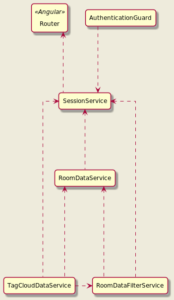
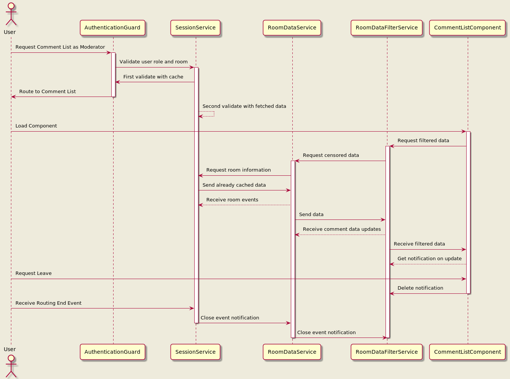

# The current data flow in frag.jetzt
frag.jetzt is an application mainly for feedback.
The application consists of rooms for each concern of a feedback topic, e.g. a module, a seminar, a lesson....
You can join these rooms as a registered or unregistered user.
Note that unregistered users have only a certain lifetime, so some features might be lost.
E.g. owning rooms or redeeming bonus vouchers.

Within a room, each user has a specific role. The roles are currently defined as follows:
```ts
export enum UserRole {
  PARTICIPANT,
  EDITING_MODERATOR,
  EXECUTIVE_MODERATOR,
  CREATOR
}
```
Note that the enumeration `EDITING_MODERATOR` is currently unused.

## Data Flow Components

The following diagram illustrates the data flow of frag.jetzt:


The main component is the SessionService. It handles direct route requests from angular.
Be it via a navigation event from angular's router or the Authentication Guard.
It validates the current user as well as the requested role and room.
It provides more functionality, it fetches all relevant room metadata for caching to keep requests to the backend to a minimum.
Of course, sometimes it still makes sense to update this data, since not all events are currently forwarded via websocket.

The session service also sends out events for a new room and room updates.
The RoomDataService is the first component to cache the most important information of a room, the comments of a room.
It additionally delivers events when comments are updated via a websocket.
It also filters profanity so that other components do not even receive profane comments.

The RoomDataFilterService is an extension of the RoomDataService,
It provides the ability to filter the current room comments with some common filtering functions.
It also provides some basic sorting functions.

The TagCloudDataService is a separate service for the tag cloud only.
It uses the events from the other services mentioned and uses the filtered data from the RoomDataFilterService to get the current data needed.

## Data Flow Example

Here is an example of a moderator joining to the comment list:


Here you can see that some information is already cached and retained even over the destruction of components.
Here the user redirects out of the room section to other components that do not need room information.
Therefore, the cache is cleared and the services are shut down.


