# Ars-Lib Docs

## Frame

- FrameType
  - ars-row
  - ars-col
- ars-fill
- ars-flex-box

### ars-row

Creates a row with variable __height__ in px.

```html
<ars-row [height]="50"></ars-row>
```

#### Input

- __height__: number
  - unit: px
  - args: height>0
  - default: 0
- __overflow__: string
  - args: visible, scroll, hidden, etc.
  - default: visible

#### Methods

- `public setPct(height: number): void`
  - set height in px
- `public setDif(height: number): void`
  - calc('100% - '+height+'px')
- `public setPx(height: number): void`
  - set height in %
- `public get(): number`
  - returns getRenderedHeight()
- `public getRenderedHeight(): number`
  - returns rendered height (offsetHeight)

#### Example

```html
<ars-screen ars-flex-box>
  <ars-row [height]="100"></ars-row>
</ars-screen>
```


---

```html
<ars-screen ars-flex-box>
  <ars-row [height]="100"></ars-row>
  <ars-row [height]="100"></ars-row>
</ars-screen>
```


---

```html
<ars-screen ars-flex-box>
  <ars-row [height]="100"></ars-row>
  <ars-row [height]="100"></ars-row>
  <ars-row [height]="100"></ars-row>
</ars-screen>
```


---

#### Scroll Behaviour

```html
<ars-screen ars-flex-box>
  <ars-col [width]="500" ars-flex-box>
    <ars-row [height]="100"></ars-row>
    <ars-row [height]="100"></ars-row>
    <ars-row [height]="100"></ars-row>
    <ars-row [height]="100"></ars-row>
    <ars-fill></ars-fill>
  </ars-col>
  <ars-fill></ars-fill>
</ars-screen>
```

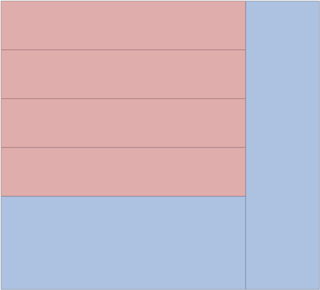


### ars-col

#### Description

Creates a column with variable __width__ in px.

```html
<ars-col [width]="50"></ars-col>
```

#### Input

- __width__: number
  - unit: px
  - args: width>0
  - default: 0
- __overflow__: string
  - args: visible, scroll, hidden, etc.
  - default: visible

#### Methods

- `public setPct(width: number): void`
  - set width in px
- `public setDif(width: number): void`
  - calc('100% - '+width+'px')
- `public setPx(width: number): void`
  - set width in %
- `public get(): number`
  - returns getRenderedWidth()
- `public getRenderedWidth(): number`
  - returns rendered width (offsetWidth)

#### Example

```html
<ars-screen ars-flex-box>
  <ars-col [width]="100"></ars-col>
</ars-screen>
```


---

```html
<ars-screen ars-flex-box>
  <ars-col [width]="100"></ars-col>
  <ars-col [width]="100"></ars-col>
</ars-screen>
```


---

```html
<ars-screen ars-flex-box>
  <ars-col [width]="100"></ars-col>
  <ars-col [width]="100"></ars-col>
  <ars-col [width]="100"></ars-col>
</ars-screen>
```


---

#### Scroll Behaviour

```html
<ars-screen ars-flex-box>
  <ars-row [height]="100" ars-flex-box>
    <ars-col [width]="100"></ars-col>
    <ars-fill></ars-fill>
    <ars-col [width]="200"></ars-col>
    <ars-fill></ars-fill>
    <ars-col [width]="100"></ars-col>
  </ars-row>
  <ars-fill></ars-fill>
</ars-screen>
```

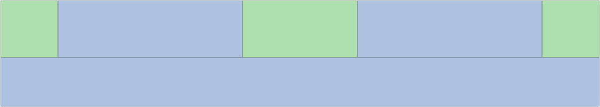


### ars-row & ars-col common Methods

- `public setPct(a: number): void`
- `public setDif(a: number): void`
- `public setPx(a: number): void`
- `public get(): number`

### ars-fill

#### Description

Fills remaining space, in combination with ars-flex-box as a parent and either ars-row or ars-col as siblings. The remaining space is evenly distributed, when multiple ars-fill are used. 

In most cases, the use of multiple ars-fill in one ars-flex-box is not recommended. ars-flex-box and ars-fill should not be used for alignment of other Elements. 

```html
<ars-fill></ars-fill>
```

#### Example

```html
<ars-screen ars-flex-box>
  <ars-row [height]="100"></ars-row>
  <ars-fill></ars-fill>
  <ars-row [height]="100"></ars-row>
</ars-screen>
```


---

```html
<ars-screen ars-flex-box>
  <ars-row [height]="100"></ars-row>
  <ars-row [height]="100"></ars-row>
  <ars-fill></ars-fill>
</ars-screen>
```


---

```html
<ars-screen ars-flex-box>
  <ars-fill></ars-fill>
  <ars-row [height]="100"></ars-row>
  <ars-row [height]="100"></ars-row>
  <ars-fill></ars-fill>
  <ars-row [height]="100"></ars-row>
</ars-screen>
```

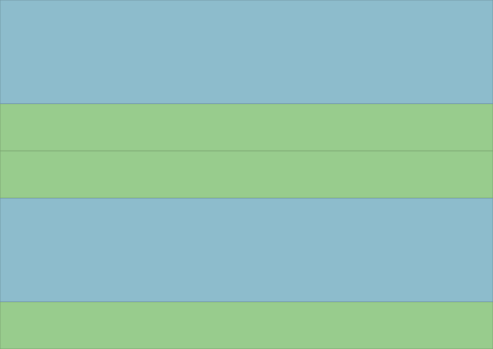

---

### ars-flex-box

#### Description

Directive, used as a Wrapper for ars-row,ars-col and ars-fill.
Either ars-row or ars-col as children.
Multiple ars-fill can be used.

Flex-Direction is determined by ars-row or ars-col.

```html
<div ars-flex-box></div>
```

#### Examples

```html
<ars-screen ars-flex-box>
  <ars-row [height]="100"></ars-row>
  <ars-fill ars-flex-box>
    <ars-col [width]="100"></ars-col>
    <ars-fill></ars-fill>
    <ars-col [width]="100"></ars-col>
  </ars-fill>
  <ars-row [height]="100"></ars-row>
</ars-screen>
```

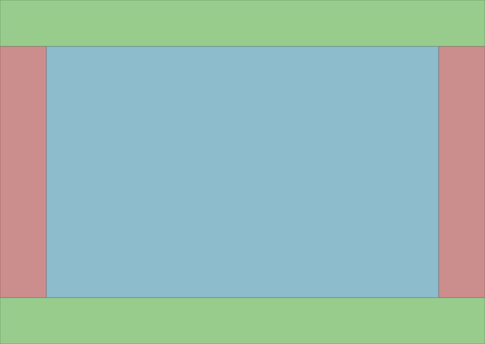

---

```html
<ars-screen ars-flex-box>
  <ars-row [height]="100"></ars-row>
  <ars-fill ars-flex-box>
    <ars-col [width]="100"></ars-col>
    <ars-fill ars-flex-box>
      <ars-row [height]="200"></ars-row>
      <ars-fill ars-flex-box>
        <ars-col [width]="300"></ars-col>
        <ars-fill></ars-fill>
      </ars-fill>
    </ars-fill>
  </ars-fill>
</ars-screen>
```

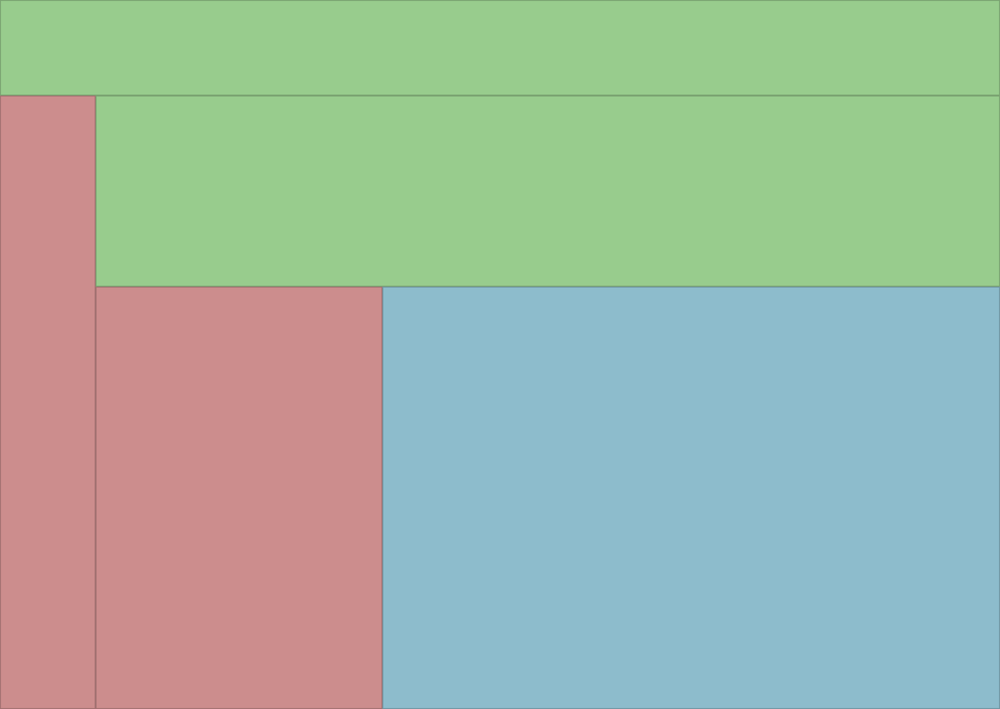

---

## Base

- ars-screen
- ars-resp
- ars-scroll

### ars-screen (full-screen-overlay)

#### Description

Wrapper, currently used for Fullscreen-Dialogs or prototyping.

```html
<ars-screen>
  <h1>Hallo</h1>
</ars-screen>
```

### ars-resp

#### Description

Creates a centered Wrapper, that automatically switches between dynamic and fixed layout. 

#### Input

- __width__: number
  - width of centered wrapper (fixed mode)
- __margin__: number
  - left and right margin, of centered wrapper (dynamic mode)
  - margin does not effect width

#### Example

```html
<ars-screen ars-flex-box>
  <ars-row [height]="64"></ars-row>
  <ars-fill [overflow]="'hidden'">
    <ars-resp ars-scroll [width]="500" [margin]="10">
      <ars-row [height]="100"></ars-row>
      <ars-row [height]="100"></ars-row>
      <ars-row [height]="100"></ars-row>
      <ars-row [height]="100"></ars-row>
      <ars-row [height]="100"></ars-row>
      <ars-row [height]="100"></ars-row>
      <ars-row [height]="100"></ars-row>
      <ars-row [height]="100"></ars-row>
      <ars-row [height]="100"></ars-row>
    </ars-resp>
  </ars-fill>
  <ars-row [height]="40"></ars-row>
</ars-screen>
```


### ars-scroll

#### Description

Directive, to force a specific scrolling behaviour.
Useful in combination with ars-resp.

## Typography

### ars-style-typography-material

#### Description

Consistent material typography for text-content.
Additional guidelines or styles for buttons, dialogs and more, will be added in the future.
Supports 165px width.

Inspired by [material.io](https://material.io/)

References (Tools):
- [Modular_Scale (8:9 - major second)](https://www.modularscale.com/?1&em&1.125)

References (Placeholder-Text):
- [Material.io - Typography](https://material.io/design/typography/understanding-typography.html#type-properties)
- [Wikipedia - Roboto](https://de.wikipedia.org/wiki/Roboto)

```html
<ars-style-typography-material>
    <!--content here-->    
</ars-style-typography-material>
```

__Note:__ `ars-style-typography-material` has no ViewEncapsulation. Multiple use in one component has no effect. Should be used as root component. Might affect child components.

#### Structure

- typo
  - lead
    - h (h1)
    - p (subtitle for lead-h)
  - main
    - h (h2)
  - page
    - h (h3)
    - p (normal paragraph)

__Lead__, __main__ and __page__ have unique classes for distances.
These classes begin with 'space', followed by the class of the next sibling.

__Note:__ `space-page-p` applied on `typo-lead-h` has different properties than `space-page-p`
applied on `typo-main-h`.

#### Behaviour

Font-size unit is __em__.
__em__ is an absolute unit, but dependent on the body font-size.
The body font-size depends on the screen width.

| screen-width | body font-size |
|---|---|
| \>600px | 100% |
| \<600px | 70% |
| \<300px | 50% |

The advantage of __em__ compared to __px__:
- body font-size can be changed, to scale the font, without changing the proportions.

---

##### typo-lead

Should be used as __h1__. (see typo-lead-h to typo-lead-p)
Can be used as __h2__, but without `typo-lead-p` (see typo-lead-h to typo-page-p)

---

###### typo-lead-h to typo-lead-p

```html
<h1 class="typo-lead-h space-lead-p">
  Roboto Typography
</h1>
<p class="typo-lead-p">
  Roboto is a neo-grotesque sans-serif typeface family developed by Google.
</p>
```

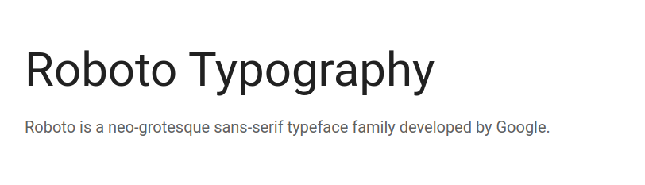

---

###### typo-lead-h to typo-page-p

```html
<h1 class="typo-lead-h space-page-p">
  Roboto (/roʊˈbɒt.oʊ/)
</h1>
<p class="typo-page-p space-page-p">
  Roboto is the default font on Android, and since 2013, other Google services such as
  Google+, Google Play, YouTube, Google Maps, and mobile Google Search.
</p>
<p class="typo-page-p space-page-p">
  In 2017 Roboto was used on the LCD countdown clocks of the New York City Subway's B
  Division lines.
</p>
<p class="typo-page-p">
  Roboto Bold is the default font in Unreal Engine 4, and in Kodi. Roboto Condensed is used
  to display Information on European versions of Nintendo Switch packaging, including
  physical releases of games.
</p>
```

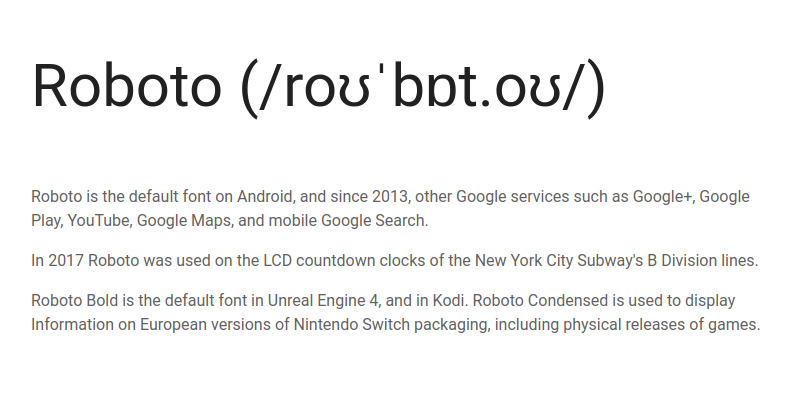

---

##### typo-main

Should be used as __h2__.
Can be used as __h3__, depending on typo-lead, being used as __h2__.

---

###### typo-main-h to typo-page-p

```html
<h1 class="typo-main-h space-page-p">
  Development
</h1>
<p class="typo-page-p space-page-p">
  The font was designed entirely in-house by Christian Robertson who previously had released
  an expanded Ubuntu-Title font through his personal type foundry Betatype. The font was
  officially made available for free download on January 12, 2012, on the newly launched
  Android Design website.
</p>
<p class="typo-page-p">
  Compared to Android's previous system font, the humanist sans-serif Droid, Roboto belongs
  to the neo-grotesque genre of sans-serif typefaces. It includes Thin, Light, Regular,
  Medium, Bold and Black weights with matching oblique styles rather than true italics. It
  also includes condensed styles in Light, Regular and Bold, also with matching oblique
  designs.
</p>
```

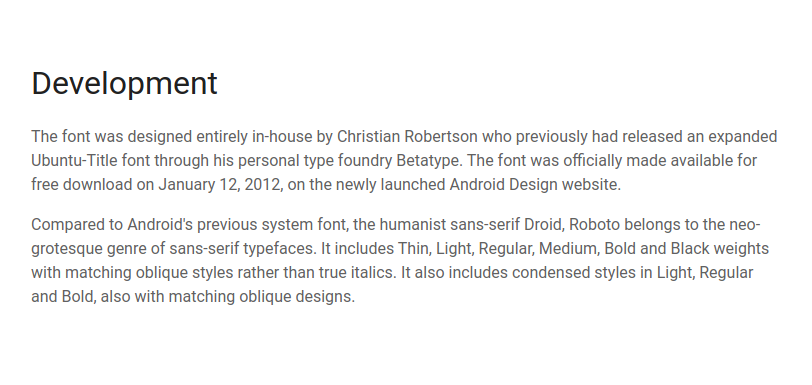

---

###### typo-main-h to typo-page-p (with following content)

```html
<h1 class="typo-main-h space-page-p">
  Redesign
</h1>
<p class="typo-page-p space-page-p">
  In 2014, Matias Duarte announced at Google I/O that Roboto was significantly redesigned for
  Android 5.0 "Lollipop".
</p>
<p class="typo-page-p space-page-p">
  Punctuation marks and the tittles in the lowercase "i" and "j" were changed from square to
  rounded, and the entire typeface was made “slightly wider and rounder” with many changes in
  details.
</p>
<ars-row [height]="200" style="background-color: rgba(0,0,0,0.1)"></ars-row>
```

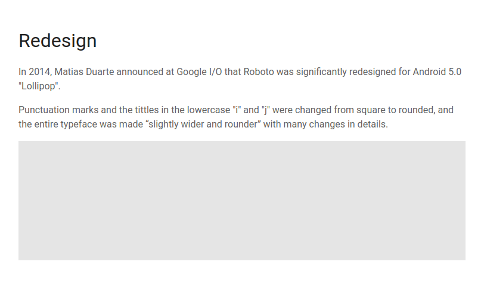

---

##### typo-page

`typo-page-h` should be used as __h3__.
Can be used as __h4__, depending on typo-main being used as __h3__.

`typo-page-p` for paragraphs.

---

###### typo-page-h to typo-page-p (with following content)

__Note:__ `typo-page-p`, followed by content, 
for example pictures, can be spaced by adding `space-page-p`

```html

<h1 class="typo-page-h space-page-p">
  Reception
</h1>
<p class="typo-page-p space-page-p">
  Google developed the font to be "modern, yet approachable" and "emotional", but Roboto
  received mixed reviews on its release. Joshua Topolsky, Editor-In-Chief of technology news
  and media network The Verge, describes the font as<br>
  <i>"clean and modern, but not overly futuristic– not a science fiction font".</i>
</p>
<ars-row [height]="200" style="background-color: rgba(0,0,0,0.1)"></ars-row>
```

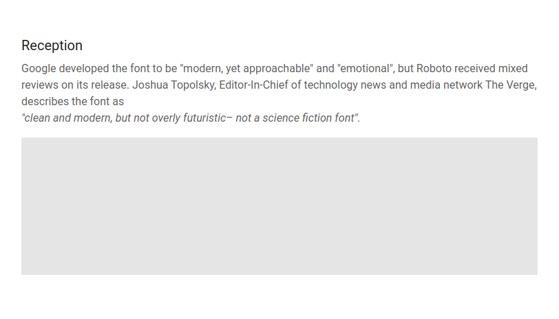

---

#### Complete Example

__Note:__ 
Don't use `ars-row` for spacing elements.
Don't use inline style.
This example uses `ars-row` for spacing elements and inline style to avoid confusing classes.

##### HTML

```html
<ars-style-typography-material>
  <ars-screen ars-scroll>
    <ars-resp [width]="750" [margin]="30">

      <ars-row [height]="300"></ars-row>

      <!-- typo-lead-h to typo-lead-p  -->

      <h1 class="typo-lead-h space-lead-p">
        Roboto Typography
      </h1>
      <p class="typo-lead-p">
        Roboto is a neo-grotesque sans-serif typeface family developed by Google.
      </p>

      <ars-row [height]="160"></ars-row>

      <!-- typo-lead-h to typo-page-p -->

      <h1 class="typo-lead-h space-page-p">
        Roboto (/roʊˈbɒt.oʊ/)
      </h1>
      <p class="typo-page-p space-page-p">
        Roboto is the default font on Android, and since 2013, other Google services such as
        Google+, Google Play, YouTube, Google Maps, and mobile Google Search.
      </p>
      <p class="typo-page-p space-page-p">
        In 2017 Roboto was used on the LCD countdown clocks of the New York City Subway's B
        Division lines.
      </p>
      <p class="typo-page-p space-page-p">
        Roboto Bold is the default font in Unreal Engine 4, and in Kodi. Roboto Condensed is used
        to display Information on European versions of Nintendo Switch packaging, including
        physical releases of games.
      </p>

      <ars-row [height]="160"></ars-row>

      <!-- typo-main-h to typo-page-p -->

      <h1 class="typo-main-h space-page-p">
        Development
      </h1>
      <p class="typo-page-p space-page-p">
        The font was designed entirely in-house by Christian Robertson who previously had released
        an expanded Ubuntu-Title font through his personal type foundry Betatype. The font was
        officially made available for free download on January 12, 2012, on the newly launched
        Android Design website.
      </p>
      <p class="typo-page-p">
        Compared to Android's previous system font, the humanist sans-serif Droid, Roboto belongs
        to the neo-grotesque genre of sans-serif typefaces. It includes Thin, Light, Regular,
        Medium, Bold and Black weights with matching oblique styles rather than true italics. It
        also includes condensed styles in Light, Regular and Bold, also with matching oblique
        designs.
      </p>

      <ars-row [height]="160"></ars-row>

      <!-- typo-main-h to typo-page-p (with box at bottom) -->

      <h1 class="typo-main-h space-page-p">
        Redesign
      </h1>
      <p class="typo-page-p space-page-p">
        In 2014, Matias Duarte announced at Google I/O that Roboto was significantly redesigned for
        Android 5.0 "Lollipop".
      </p>
      <p class="typo-page-p space-page-p">
        Punctuation marks and the tittles in the lowercase "i" and "j" were changed from square to
        rounded, and the entire typeface was made “slightly wider and rounder” with many changes in
        details.
      </p>
      <ars-row [height]="200" style="background-color: rgba(0,0,0,0.1)"></ars-row>

      <ars-row [height]="160"></ars-row>

      <!-- typo-page-h to typo-page-p (with box at bottom) -->

      <h1 class="typo-page-h space-page-p">
        Reception
      </h1>
      <p class="typo-page-p space-page-p">
        Google developed the font to be "modern, yet approachable" and "emotional", but Roboto
        received mixed reviews on its release. Joshua Topolsky, Editor-In-Chief of technology news
        and media network The Verge, describes the font as<br>
        <i>"clean and modern, but not overly futuristic– not a science fiction font".</i>
      </p>
      <ars-row [height]="200" style="background-color: rgba(0,0,0,0.1)"></ars-row>

      <ars-row [height]="160"></ars-row>

      <!-- typo-page-h to typo-page-p -->

      <h1 class="typo-page-h space-page-p">
        Measurement from the baseline
      </h1>
      <p class="typo-page-p">
        Specify distances from UI elements from the baseline. Baseline values are
        software-agnostic, so they work in any design program, and work with the grid. On Android
        and iOS, code can be translated from baseline-relative specs into padding. For the web,
        automate the calculation using Sass or CSS.
      </p>

      <ars-row [height]="160"></ars-row>

    </ars-resp>
  </ars-screen>
</ars-style-typography-material>
```

##### On Desktop

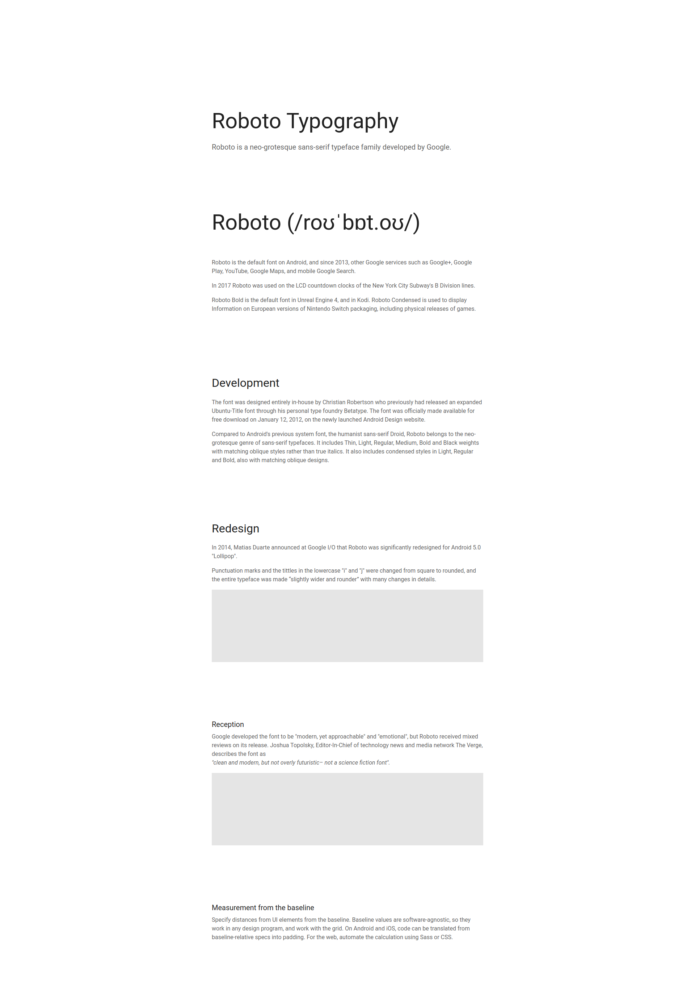

##### On Mobile (iPhone 4)

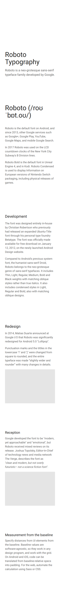


