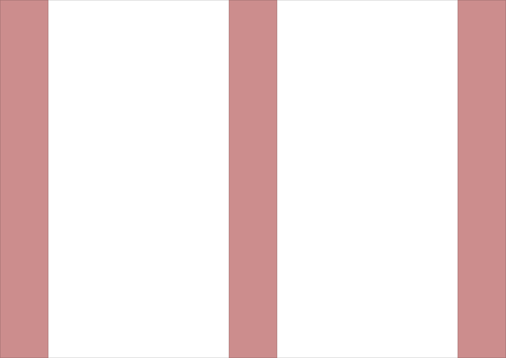
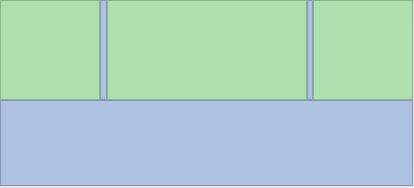
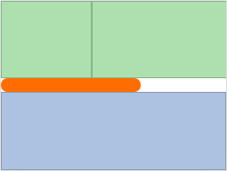
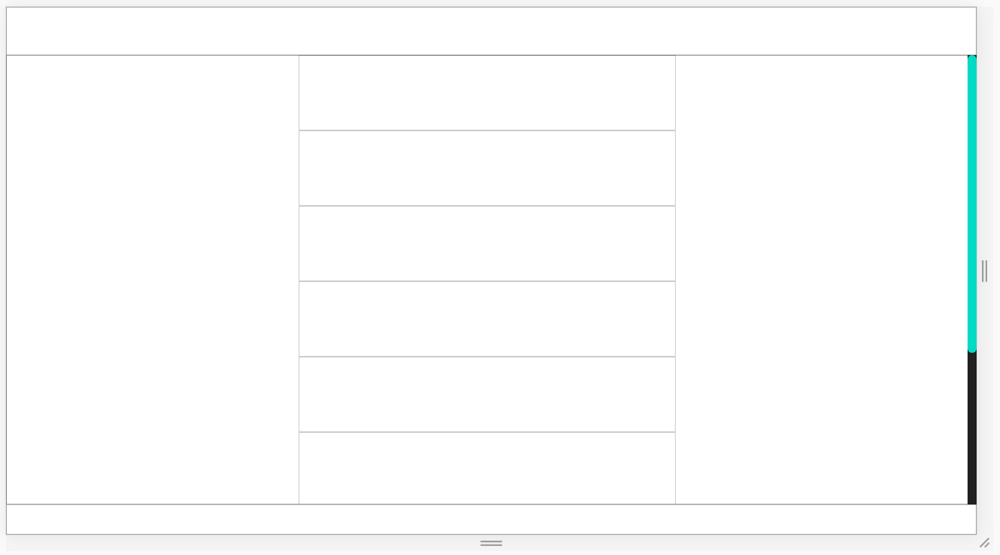
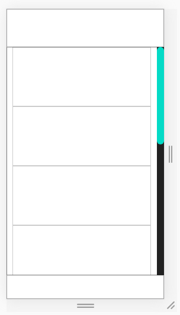

# Ars-Lib Docs

## Frame

- FrameType
  - ars-row
  - ars-col
- ars-fill
- ars-flex-box

### ars-row

Creates a row with variable __height__ in px.

```html
<ars-row [height]="50"></ars-row>
```

#### Input

- __height__: number
  - unit: px
  - args: height>0
  - default: 0
- __overflow__: string
  - args: visible, scroll, hidden, etc.
  - default: visible

#### Methods

- `public setPct(height: number): void`
  - set height in px
- `public setDif(height: number): void`
  - calc('100% - '+height+'px')
- `public setPx(height: number): void`
  - set height in %
- `public get(): number`
  - returns getRenderedHeight()
- `public getRenderedHeight(): number`
  - returns rendered height (offsetHeight)

#### Example

```html
<ars-screen ars-flex-box>
  <ars-row [height]="100"></ars-row>
</ars-screen>
```


---

```html
<ars-screen ars-flex-box>
  <ars-row [height]="100"></ars-row>
  <ars-row [height]="100"></ars-row>
</ars-screen>
```


---

```html
<ars-screen ars-flex-box>
  <ars-row [height]="100"></ars-row>
  <ars-row [height]="100"></ars-row>
  <ars-row [height]="100"></ars-row>
</ars-screen>
```


---

#### Scroll Behaviour

```html
<ars-screen ars-flex-box>
  <ars-col [width]="500" ars-flex-box>
    <ars-row [height]="100"></ars-row>
    <ars-row [height]="100"></ars-row>
    <ars-row [height]="100"></ars-row>
    <ars-row [height]="100"></ars-row>
    <ars-fill></ars-fill>
  </ars-col>
  <ars-fill></ars-fill>
</ars-screen>
```


### ars-col

#### Description

Creates a column with variable __width__ in px.

```html
<ars-col [width]="50"></ars-col>
```

#### Input

- __width__: number
  - unit: px
  - args: width>0
  - default: 0
- __overflow__: string
  - args: visible, scroll, hidden, etc.
  - default: visible

#### Methods

- `public setPct(width: number): void`
  - set width in px
- `public setDif(width: number): void`
  - calc('100% - '+width+'px')
- `public setPx(width: number): void`
  - set width in %
- `public get(): number`
  - returns getRenderedWidth()
- `public getRenderedWidth(): number`
  - returns rendered width (offsetWidth)

#### Example

```html
<ars-screen ars-flex-box>
  <ars-col [width]="100"></ars-col>
</ars-screen>
```


---

```html
<ars-screen ars-flex-box>
  <ars-col [width]="100"></ars-col>
  <ars-col [width]="100"></ars-col>
</ars-screen>
```


---

```html
<ars-screen ars-flex-box>
  <ars-col [width]="100"></ars-col>
  <ars-col [width]="100"></ars-col>
  <ars-col [width]="100"></ars-col>
</ars-screen>
```



---

#### Scroll Behaviour

```html
<ars-screen ars-flex-box>
  <ars-row [height]="100" ars-flex-box>
    <ars-col [width]="100"></ars-col>
    <ars-fill></ars-fill>
    <ars-col [width]="200"></ars-col>
    <ars-fill></ars-fill>
    <ars-col [width]="100"></ars-col>
  </ars-row>
  <ars-fill></ars-fill>
</ars-screen>
```







### ars-row & ars-col common Methods

- `public setPct(a: number): void`
- `public setDif(a: number): void`
- `public setPx(a: number): void`
- `public get(): number`

### ars-fill

#### Description

Fills remaining space, in combination with ars-flex-box as a parent and either ars-row or ars-col as siblings. The remaining space is evenly distributed, when multiple ars-fill are used. 

In most cases, the use of multiple ars-fill in one ars-flex-box is not recommended. ars-flex-box and ars-fill should not be used for alignment of other Elements. 

```html
<ars-fill></ars-fill>
```

#### Example

```html
<ars-screen ars-flex-box>
  <ars-row [height]="100"></ars-row>
  <ars-fill></ars-fill>
  <ars-row [height]="100"></ars-row>
</ars-screen>
```


---

```html
<ars-screen ars-flex-box>
  <ars-row [height]="100"></ars-row>
  <ars-row [height]="100"></ars-row>
  <ars-fill></ars-fill>
</ars-screen>
```


---

```html
<ars-screen ars-flex-box>
  <ars-fill></ars-fill>
  <ars-row [height]="100"></ars-row>
  <ars-row [height]="100"></ars-row>
  <ars-fill></ars-fill>
  <ars-row [height]="100"></ars-row>
</ars-screen>
```


---

### ars-flex-box

#### Description

Directive, used as a Wrapper for ars-row,ars-col and ars-fill.
Either ars-row or ars-col as children.
Multiple ars-fill can be used.

Flex-Direction is determined by ars-row or ars-col.

```html
<div ars-flex-box></div>
```

#### Examples

```html
<ars-screen ars-flex-box>
  <ars-row [height]="100"></ars-row>
  <ars-fill ars-flex-box>
    <ars-col [width]="100"></ars-col>
    <ars-fill></ars-fill>
    <ars-col [width]="100"></ars-col>
  </ars-fill>
  <ars-row [height]="100"></ars-row>
</ars-screen>
```


---

```html
<ars-screen ars-flex-box>
  <ars-row [height]="100"></ars-row>
  <ars-fill ars-flex-box>
    <ars-col [width]="100"></ars-col>
    <ars-fill ars-flex-box>
      <ars-row [height]="200"></ars-row>
      <ars-fill ars-flex-box>
        <ars-col [width]="300"></ars-col>
        <ars-fill></ars-fill>
      </ars-fill>
    </ars-fill>
  </ars-fill>
</ars-screen>
```


---

## Base

- ars-screen
- ars-resp
- ars-scroll

### ars-screen (full-screen-overlay)

#### Description

Wrapper, currently used for Fullscreen-Dialogs or prototyping.

```html
<ars-screen>
  <h1>Hallo</h1>
</ars-screen>
```

## ars-resp

### Description

Creates a centered Wrapper, that automatically switches between dynamic and fixed layout. 

### Input

- __width__: number
  - width of centered wrapper (fixed mode)
- __margin__: number
  - left and right margin, of centered wrapper (dynamic mode)
  - margin does not effect width

### Example

```html
<ars-screen ars-flex-box>
  <ars-row [height]="64"></ars-row>
  <ars-fill [overflow]="'hidden'">
    <ars-resp ars-scroll [width]="500" [margin]="10">
      <ars-row [height]="100"></ars-row>
      <ars-row [height]="100"></ars-row>
      <ars-row [height]="100"></ars-row>
      <ars-row [height]="100"></ars-row>
      <ars-row [height]="100"></ars-row>
      <ars-row [height]="100"></ars-row>
      <ars-row [height]="100"></ars-row>
      <ars-row [height]="100"></ars-row>
      <ars-row [height]="100"></ars-row>
    </ars-resp>
  </ars-fill>
  <ars-row [height]="40"></ars-row>
</ars-screen>
```





## ars-scroll

### Description

Directive, to force a specific scrolling behaviour.
Useful in combination with ars-resp.
