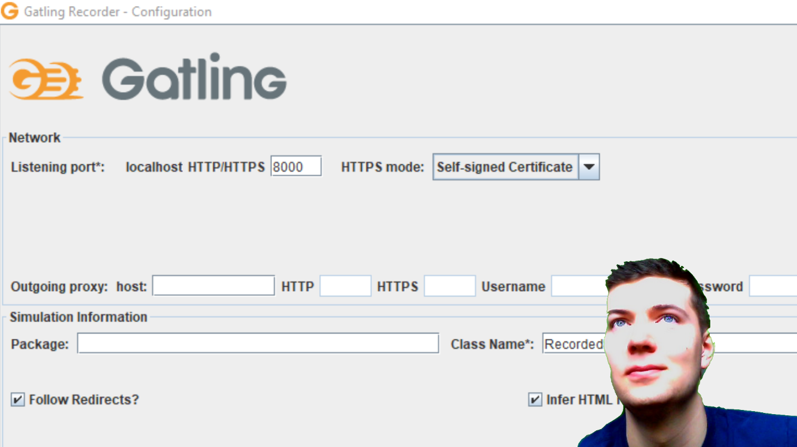
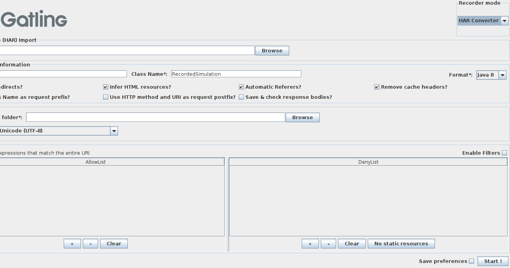
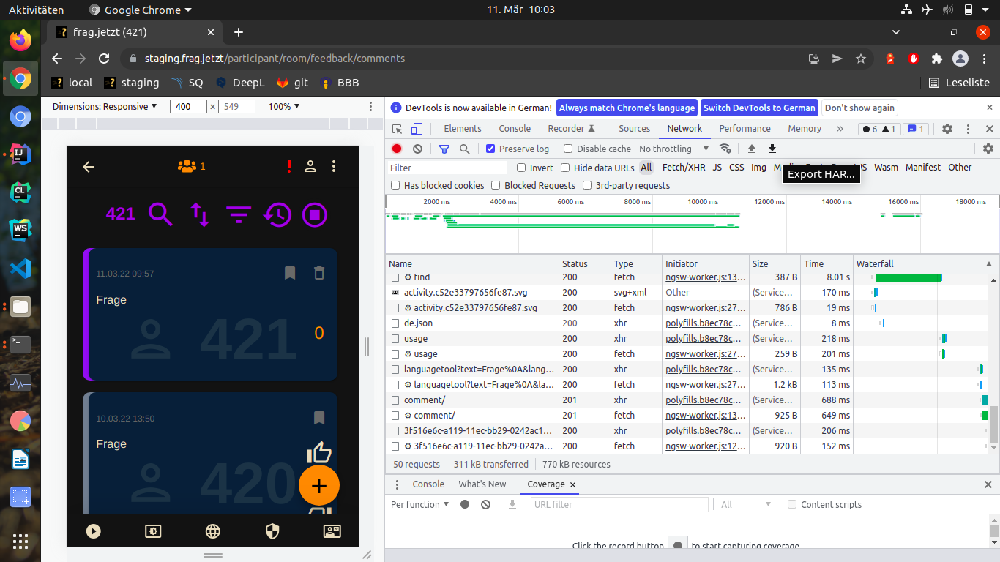
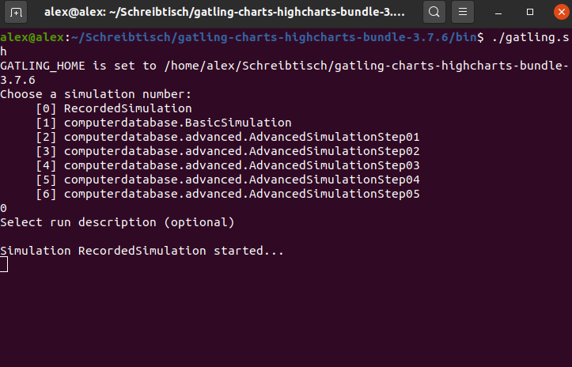
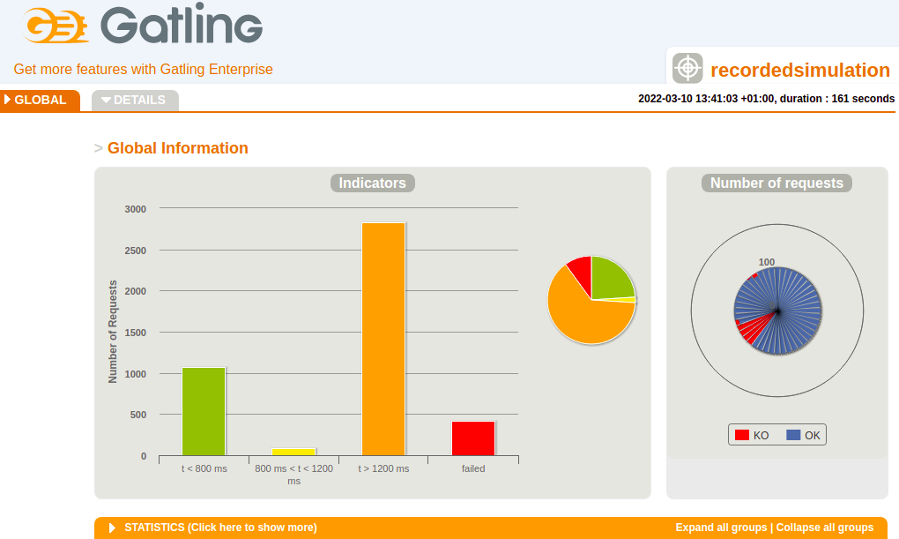

# How to create load tests

## Check out the how to videos on YouTube

1. [How to video for Windows short version](https://youtu.be/SG1vJFU766o)
2. [How to video for Windows with installations](https://youtu.be/3ULj-zTm15k)
3. [How to video for Linux](https://youtu.be/DZkG2_nUP1g)
4. [Check out the Gatling playlist](https://www.youtube.com/watch?v=3ULj-zTm15k&list=PLAYwej9k8wpQgjyE0l-DUJLFTuI8LcRaB&index=2)

## Download the videos for your own use (.mp4 file)

1. [Download how to video for Windows short version](https://www.dropbox.com/t/0c219NCFNRQG5NWH)
2. [Download how to video for Windows with installations](https://www.dropbox.com/t/uXjexYB3GJlTSUtc)
3. [Download how to video for Linux](https://www.dropbox.com/t/GKAAtaMCOTXdiSki)

## Gatling quick guide

1. [Download Gatling](https://gatling.io/open-source/)
2. Unzip Gatling

## Create load tests

1. Open the folder `gatling-charts-highcharts-bundle` and then open the folder `bin`.
2. Open a terminal in this bin folder and start the GUI by entering this command Linux: `./recorder.sh`, Windows: `recorder.bat` and it will open the GUI.

3. Select `HAR Converter` recorder mode at the top right.
4. Open the `Chrome Dev Tools` and generate a HAR file on the website where you want to perform the load test and Click on Export HAR (all details are shown in the how to video on [YouTube](https://www.youtube.com/watch?v=3ULj-zTm15k&list=PLAYwej9k8wpQgjyE0l-DUJLFTuI8LcRaB&index=2)).

5. Now load the HAR file in the GUI and click on start in the lower right corner. A simulation file will now be created.

6. Open the folder `gatling-charts-highcharts-bundle` open the folder `user-files` and then open the folder `simulations`. A new `.java` file has been created. 
7. Open this `.java` file in the IDE of your choice or with a text editor.
8. Scroll all the way down until you see `setUp(scn.injectOpen(atOnceUsers(1))).protocols(httpProtocol);`.
9. Now change the `1` with any number. This number determines the number of simulated users that perform the load test on the website under test.
10. Open the folder `gatling-charts-highcharts-bundle` and then open the folder `bin`.
11. Open a terminal in this bin folder and start the load test by entering this command Linux: `./gatling.sh`, Windows: `gatling.bat` and it will open the load test.

12. Select the simulation you just created by typing the corresponding number and pressing enter.
13. After the load test is finished open the folder `gatling-charts-highcharts-bundle` and then open the folder `results`.
14. These folders are created after a load test is finished. 
15. Now select one of the folders and open `index.html`.
16. Now you can look at the details of your load test. (You can get more information in the how to video on [YouTube](https://www.youtube.com/watch?v=3ULj-zTm15k&list=PLAYwej9k8wpQgjyE0l-DUJLFTuI8LcRaB&index=2)).

